# Footprinting — HTB Academy Skills Assessment

## Overview

Multi-stage footprinting engagement targeting a network with diverse services. The objective was to enumerate and chain together findings across FTP, SSH, NFS, SMB, SNMP, RDP, and MySQL to recover hidden credentials and flags.

**Services Discovered:** FTP, ProFTPD, SMB, NFS, SNMP, SSH, MySQL, RDP  
**Open Ports:** 21, 2121, 22, 111, 143, 445, 33060  
**Target Network:** 10.0.0.0/8 (HTB lab environment)

---

## Phase 1 — FTP Enumeration & SSH Access

### Step 1: Initial Reconnaissance

Ran an Nmap scan against the target server and identified a personal FTP server among the exposed services.

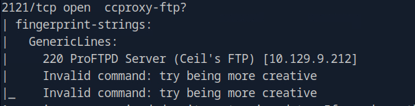

### Step 2: FTP Access & Key Retrieval

Logged into the FTP server using provided credentials. Navigating the file structure revealed an `id_rsa` private key file, which was transferred to the attack machine.

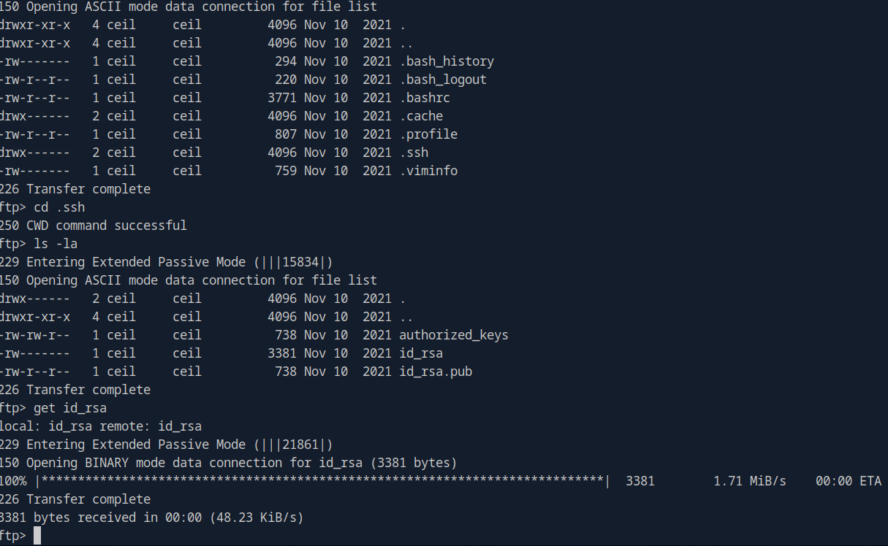

### Step 3: SSH Login via Stolen Key

Set proper permissions on the recovered key (`chmod 600`) and used it to authenticate against the open SSH port.

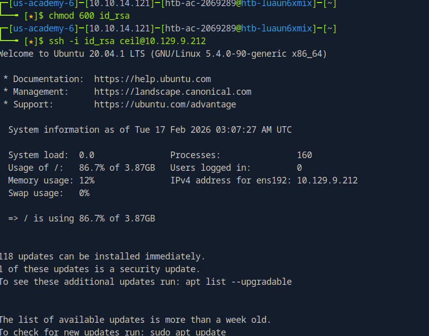

### Step 4: Flag Recovery

Navigated the SSH server's file system and located the flag.

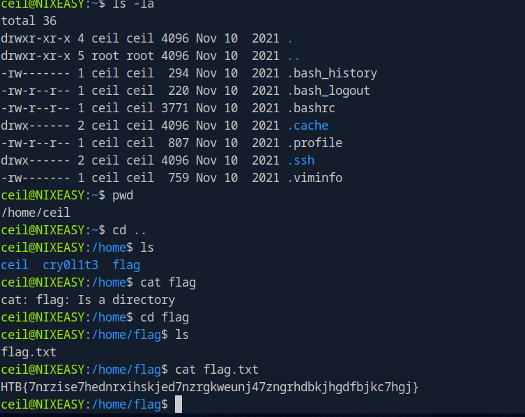

> **Note:** Flag value redacted. Screenshot contains the cleartext flag.

---

## Phase 2 — NFS & SMB Chaining

### Step 5: Targeted Port Scanning

Ran two Nmap scans — a quick scan to identify open ports, then an aggressive scan (`-A`) against only the discovered ports. This approach saves time by avoiding unnecessary enumeration.

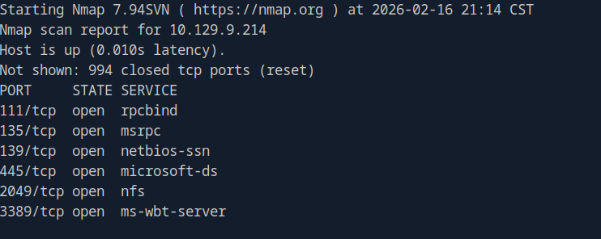
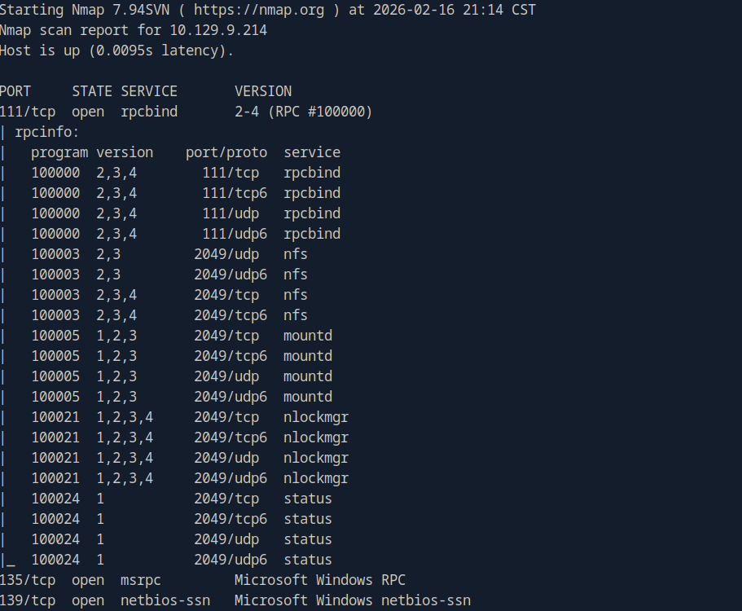

### Step 6: NFS Mount Point Discovery

Identified NFS mount points available on the target using standard enumeration commands.

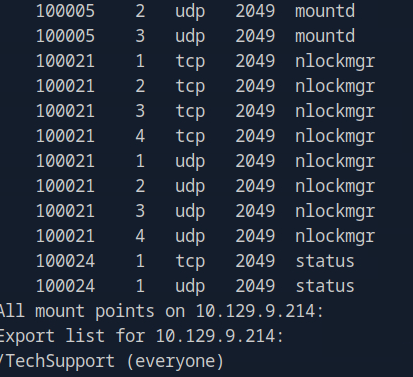

### Step 7: Mounting & Lateral Access

Mounted the remote NFS share locally and accessed the tech support directory.

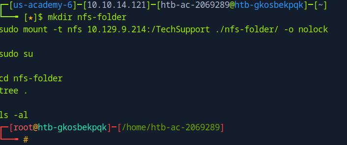

### Step 8: Credential Harvesting via Ticket Files

Found a directory containing numerous ticket files. Used `grep` to search for password strings across all tickets, recovering a set of credentials.

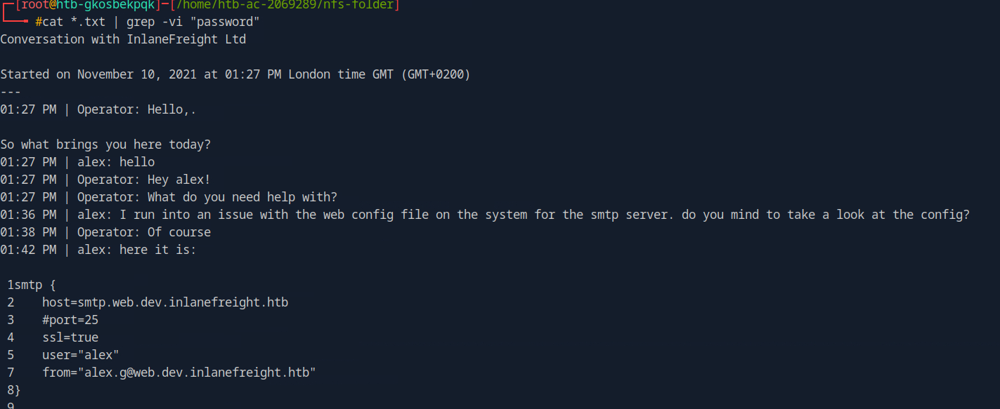
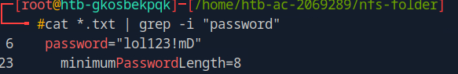

> **Note:** Discovered credentials redacted from writeup text. Screenshot contains cleartext password.

### Step 9: SMB Enumeration with Recovered Credentials

Used the discovered credentials with `crackmapexec` to identify accessible SMB shares on port 445. Logged into the share and located an `important.txt` file.

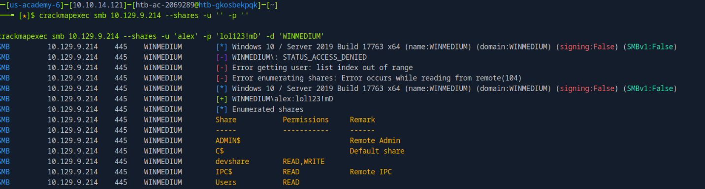
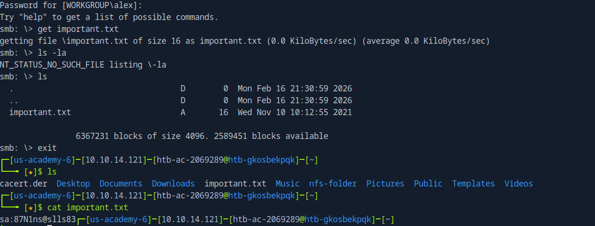

---

## Phase 3 — RDP Access & Database Exploitation

### Step 10: RDP Login

The contents of `important.txt` appeared to be a credential. Combined with the earlier Nmap results showing RDP open, used `xfreerdp` to authenticate to the target.

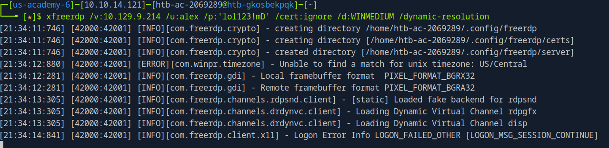

> **Note:** RDP command in screenshot contains cleartext username and password.

### Step 11: Server Enumeration via RDP

The recovered credentials turned out to be the administrator password. Enumerated the server software and file shares, discovering additional user credentials through trial and error.

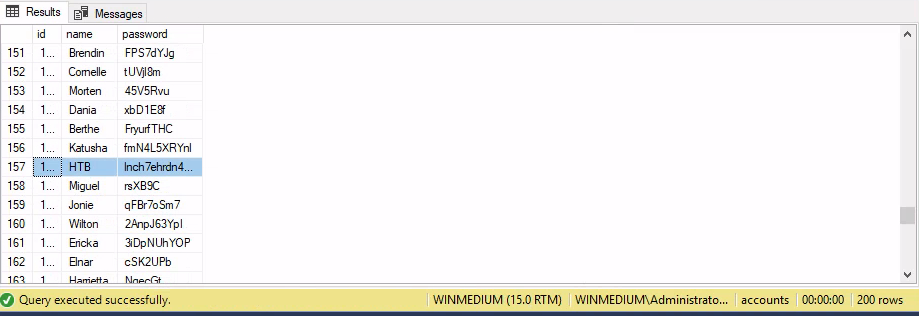

> **Note:** Screenshot shows a database table containing usernames and passwords in cleartext.

---

## Phase 4 — SNMP & MySQL Enumeration

### Step 12: SNMP Discovery

Enumerated additional ports and identified an SNMP service. Used `onesixtyone` to perform a dictionary attack against the SNMP community strings, revealing the server name.

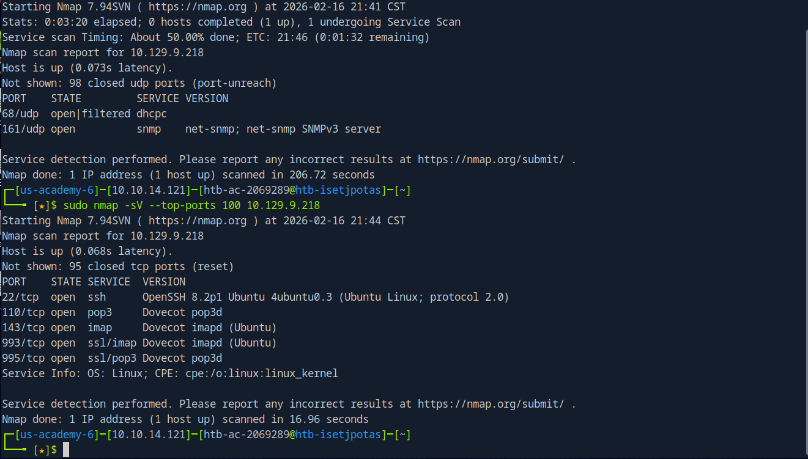
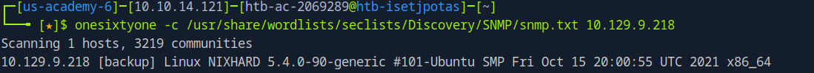

### Step 13: SNMP Deep Dive & SSH Key Recovery

Authenticated to the SNMP service and performed deeper enumeration. Discovered emails containing an embedded SSH key. Used the key to access the SSH server, where MySQL configuration details and user information were found.

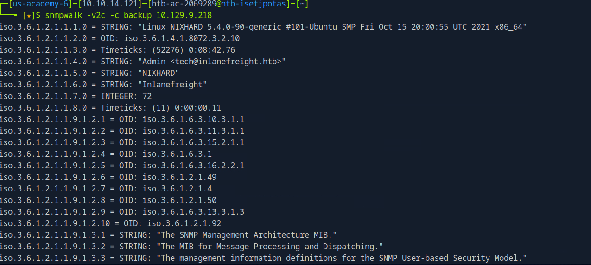
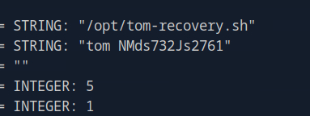
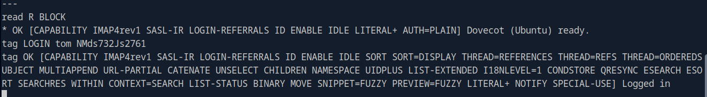
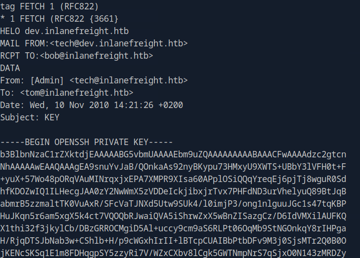
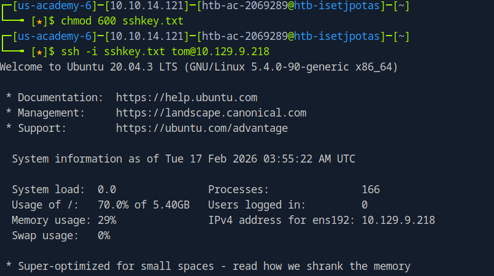
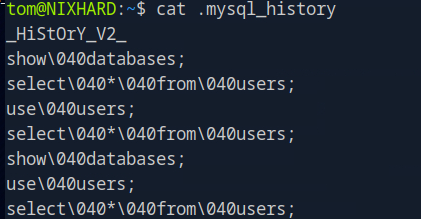

### Step 14: MySQL Exploitation & Final Flag

Identified MySQL running on the network. Used discovered credentials with a default password to authenticate to the MySQL server. Enumerated the database tables and recovered the hidden flag.

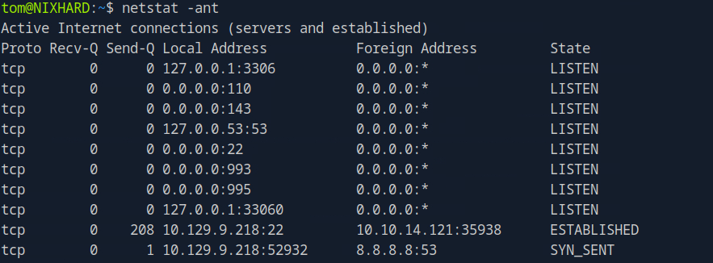
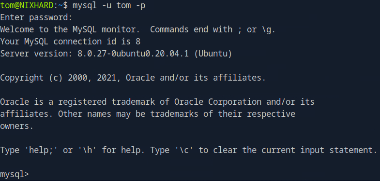
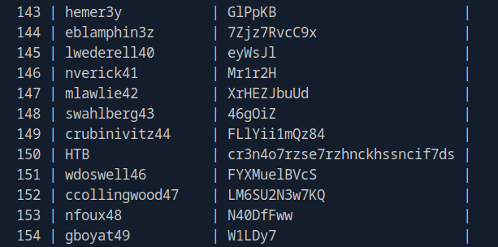

> **Note:** Screenshots contain cleartext database credentials and the final flag value.

---

## Tools Used

`nmap` · `ftp` · `ssh` · `mount` (NFS) · `grep` · `crackmapexec` · `smbclient` · `xfreerdp` · `onesixtyone` · `snmpwalk` · `mysql`

## Key Techniques

- **Service chaining** — Each phase's output became the next phase's input (FTP → SSH → NFS → SMB → RDP → SNMP → MySQL)
- **Targeted scanning** — Quick scan first, then aggressive scan on discovered ports only
- **Credential reuse** — Passwords discovered in one service were tested against others
- **File system enumeration** — Systematic directory traversal to locate keys, configs, and flags

## MITRE ATT&CK Mapping

| Technique | ID | Phase |
|---|---|---|
| Network Service Discovery | T1046 | Reconnaissance |
| Valid Accounts | T1078 | FTP/SSH/RDP/MySQL Access |
| Remote Services: SSH | T1021.004 | Lateral Movement |
| Remote Services: SMB | T1021.002 | Lateral Movement |
| Remote Services: RDP | T1021.001 | Lateral Movement |
| Unsecured Credentials: Private Keys | T1552.004 | Credential Access |
| Unsecured Credentials: Credentials in Files | T1552.001 | Credential Access |
| Data from Network Shared Drive | T1039 | Collection |
