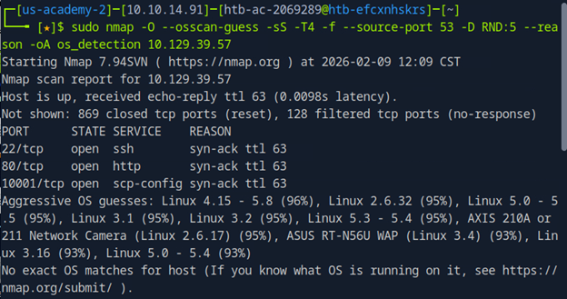
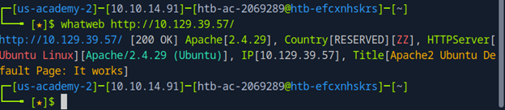
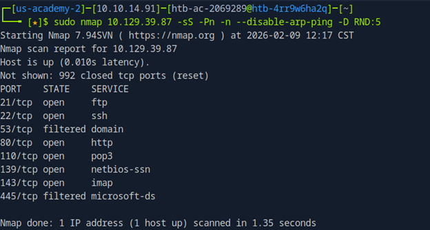
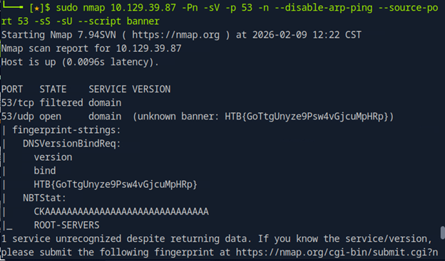
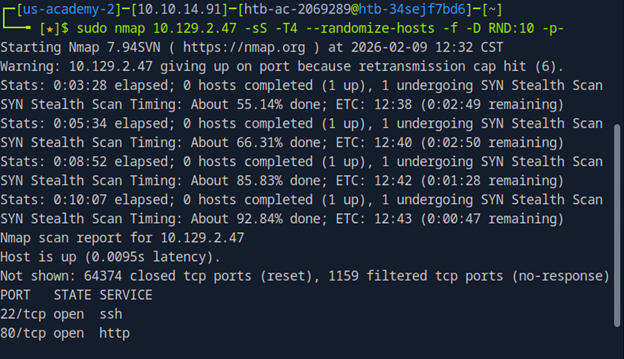
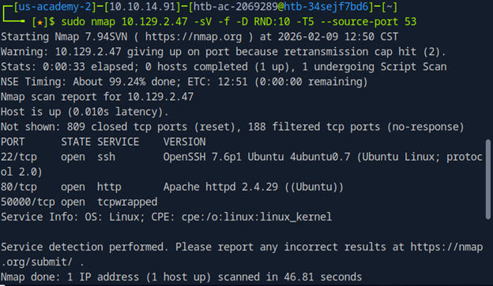
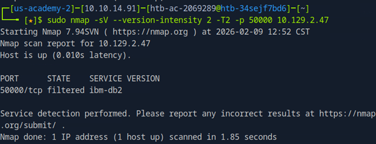
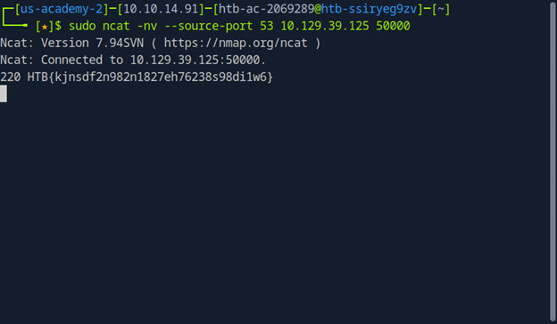

# IDS/IPS and Firewall Evasion — Vulnerability Assessment

**Author:** Spencer Leach  
**Date:** February 9, 2026  
**Platform:** HackTheBox / Pikes Peak State College Lab  
**Topics:** Network Reconnaissance, IDS/IPS Evasion, Source Port Spoofing, Banner Grabbing

---

## Executive Summary

An IT company contracted a penetration tester to assess their IPS/IDS detection systems. The engagement was iterative — the company remediated issues as they were discovered, and testing continued until they were satisfied with their security posture. The final deliverable includes remediation recommendations based on findings across all test rounds.

---

## Scope

| IP Range | Ports | Services |
|----------|-------|----------|
| 10.129.0.0/16 | All TCP and UDP | Any |

> **Rules of Engagement:** Interaction with services only — no exploitation.

---

## Steps Taken

### 1. Initial OS Fingerprinting (Stealth Nmap Scan)

A comprehensive but stealthy Nmap scan was run to identify the operating system. Linux was apparent from initial results, but the specific distribution was needed for precision.

---

### 2. OS Version via WhatWeb

HTTP was open on the target. WhatWeb was used to grab the OS version via the HTTP server banner — faster and more reliable than Nmap for this specific use case when HTTP is available.

---

### 3. DNS Enumeration After IDS Update

The company updated their detection capabilities. A more targeted Nmap scan was run to find whether DNS was open — an open DNS port would immediately expose its banner.

---

### 4. DNS UDP Scan (TCP Filtered)

DNS TCP was filtered — consistent with common security hardening that restricts TCP on DNS to prevent large zone transfers while keeping UDP open for functionality. An aggressive UDP scan was run based on this assumption.

---

### 5. New Service Discovery After Second IDS Update

The company updated detection again and mentioned a new service running on a non-standard port. An initial Nmap scan found nothing — the IPS was blocking discovery. A different approach was needed.

---

### 6. Source Port Spoofing to Bypass Firewall

Firewalls are commonly misconfigured to trust all traffic originating from port 53 (DNS), since blocking DNS traffic can break network functionality for users. By spoofing the source port to 53, the scan bypassed the firewall and revealed a name-protected service running on **port 50000**.

---

### 7. Service Identification (and a Mistake)

The service on port 50000 was wrapped by `tcpwrapped`, hiding the service name. A targeted stealth scan was attempted — however, the source port was not specified this time, causing the session to be locked out by the firewall. A fresh IP was required to continue.

> **Lesson learned:** Once source port spoofing is established as a bypass technique, it must be maintained consistently across all subsequent requests to avoid triggering lockout.

---

### 8. Banner Grab via Netcat

Netcat was used for the final banner grab rather than Nmap, for two key reasons:
- Netcat lacks Nmap's complex abort logic and will wait for a service response regardless
- Since port 53 was trusted by the firewall, the spoofed source port meant discovery risk was low

Netcat connected, waited for the service to respond, and captured the banner (HTB flag).

---

## Findings

**No specific CVEs were identified.** The primary finding maps to:

- **CWE-200: Exposure of Sensitive Information to an Unauthorized Actor** — misconfigurations allowed successful reconnaissance that could serve as a foundation for further exploitation.

---

## Remediation Recommendations

### Source Port Filtering
- Do not implicitly trust traffic based on source port alone
- Deploy Deep Packet Inspection (DPI) to verify DNS traffic is actually DNS
- Block outbound connections to unusual destination ports even if they claim to originate from port 53

### Comprehensive Port Coverage
- Avoid security through obscurity — non-standard ports (like 50000) do not provide meaningful protection
- Document and justify all open ports; run regular internal network scans
- Default-deny all traffic at the firewall; allow only explicitly needed services

### IDS/IPS Hardening
- Update signatures to detect decoy scanning, stealth scans, and source port manipulation
- Deploy IDS/IPS at multiple network layers, not just the perimeter
- Enable anomaly-based detection alongside signature-based detection to catch novel evasion techniques
