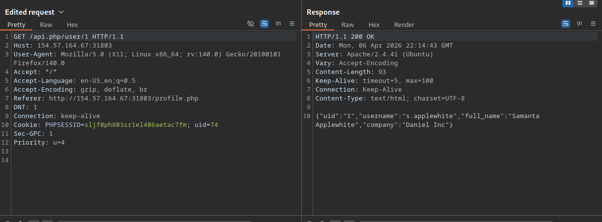
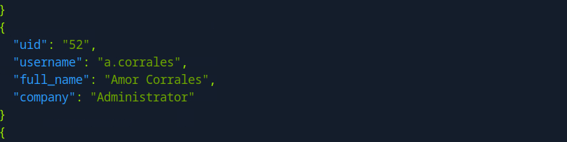
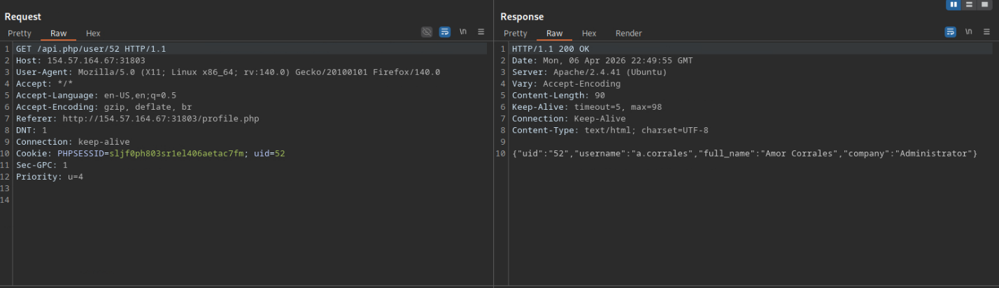
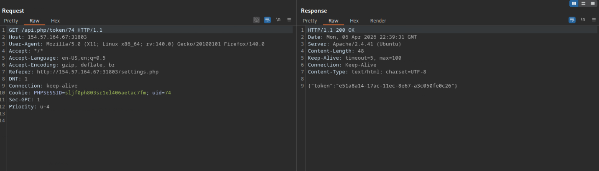
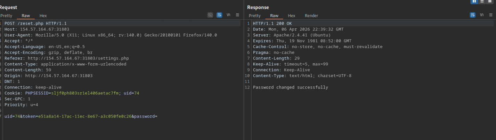
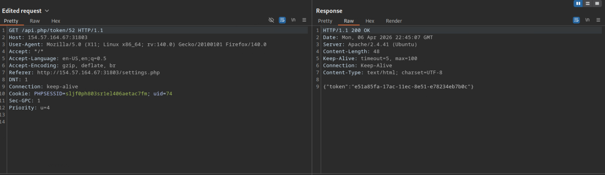
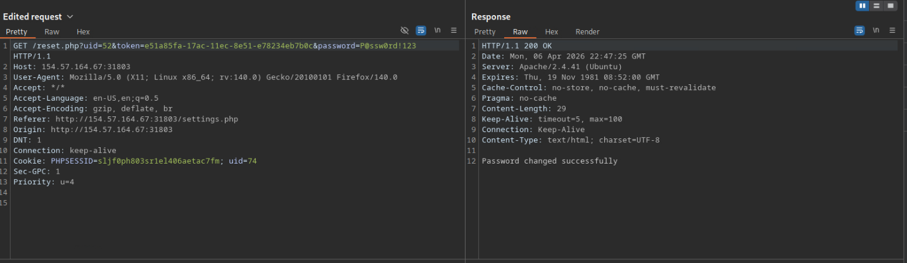
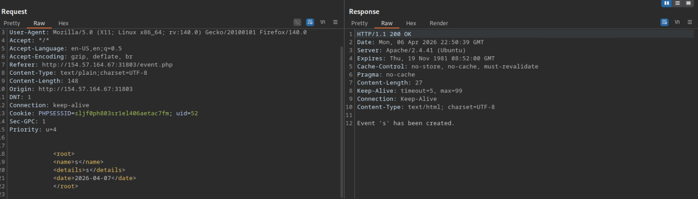
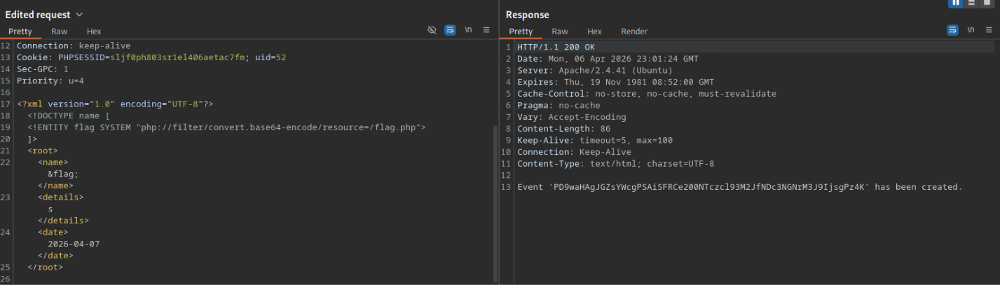
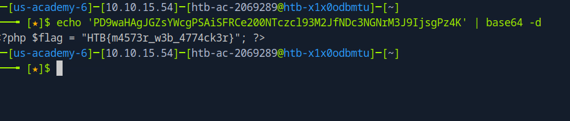

# Web Attacks — IDOR and XXE Injection

## Assets

- **Target:** Webserver at 154.57.164.67 Port 31803

---

## Steps Taken

### Step 1: Logging in and Enumerating Website Structure

Logging in and capturing the Burp Suite information showed that the parameter after user matched the uid, meaning that the number correlated to user IDs of other users. So changing that parameter should give us information of other users in the response page. And it did — after that I ran a curl command that enumerated UIDs 1–200, and UID 52 identified itself as the admin account. So UID 52 was going to be the account we target, but we needed more info on how the objects were referenced first.

### Step 2: Using Burp to Find References to Indirect Objects

Snooping through the different parts of the website we find that if we change our password, we find the structure of the IDORs.

We also see that we can find tokens within the directory `/api.php/token/*uid*`.

The fact that we were able to change our password to a blank password means there's probably no input validation on what we can change the password to. It ended up not being relevant information for this engagement but worth noting.

### Step 3: Find the Token for the Admin Account and Gain Access

Earlier we found a similar structure in the filesystem where we were able to view other's account information by changing the uid that was being referenced. Applying that same principle, we navigate to the webpage that is hosting the admin token and harvest it.

We should be able to change the password to whatever we wanted, but just to make sure I didn't run into any errors I changed the admin password into something simple but technically complex.

The POST request wasn't going to work because that information captured by Burp was generated after the GET request was made from within the browser. Since we can't perform this attack from the browser, we must use the same HTTP parameter it would've used which in this case was GET. It's not shown here but the JSON code did reveal that there was no HTTP tampering input validation.

The password reset worked great and we got access to the admin page through IDOR vulnerabilities.

### Step 4: XML Injection

We discovered some XML code, so now it's time to see if we can inject our own commands and references to get the webserver to output the flag.php file we are supposed to target.

We might've started this step with some enumeration of the file structure, but since the HTB question makes a direct reference to a file path on the webserver it's not necessary to do filesystem enumeration.

We borrow some one-liner commands from the HTB cheat sheet to reveal a base64-encoded flag.

Next, we simply decode the command to reveal the flag. We're the winners, hooray!

---

## Findings and Remediation

### Finding 1: Insecure Direct Object Reference (IDOR)

The application exposed sequential integer user IDs as URL parameters with no server-side authorization checks, allowing enumeration of all user accounts via a simple curl loop. The admin account was identified at UID 52 and its authentication token was accessible at `/api.php/token/52` without any privilege verification. This enabled full account takeover without requiring valid admin credentials.

**Remediation:** Implement server-side access controls that verify the authenticated session is authorized to access each requested resource before returning data. Replace sequential integer IDs with non-guessable UUIDs or opaque tokens, and validate all direct object references against the current user's session on every request.

### Finding 2: Missing Password Input Validation

The password change endpoint accepted blank and arbitrarily weak passwords without any server-side validation or complexity enforcement. This confirms the application relies solely on client-side controls, if any, which can be trivially bypassed. While this was not directly required for the engagement objective, it significantly lowers the bar for follow-on access by any attacker who obtains account access.

**Remediation:** Enforce password complexity requirements (minimum length, mixed character classes) on the server side. Client-side validation is not a security control and must be backed by server-side enforcement. Additionally, consider rate-limiting and logging password change requests to detect abuse.

### Finding 3: HTTP Method Tampering

The password reset endpoint, intended to receive POST requests, also processed GET requests carrying the same parameters. Since the browser-generated POST could not be replicated externally, the attack was re-issued as a GET request and was accepted without restriction. This indicates no HTTP method enforcement was present, which widens the attack surface and can undermine CSRF protections that assume method separation.

**Remediation:** Restrict sensitive endpoints to the intended HTTP methods at the framework or server level and return a 405 Method Not Allowed response for any other method. Avoid allowing state-changing operations via GET requests, as GET is considered a safe, idempotent method and may be logged, cached, or replayed in ways POST is not.

### Finding 4: XML External Entity (XXE) Injection

The application parsed user-supplied XML input without disabling external entity processing. By injecting a DOCTYPE declaration with an external entity reference pointing to `/flag.php`, we forced the server to read the target file and return its contents embedded in the XML response as a base64-encoded string. This class of vulnerability can expose arbitrary local files, internal network resources, or be chained into server-side request forgery (SSRF) depending on parser configuration.

**Remediation:** Disable DTD processing and external entity resolution entirely in the XML parser configuration. Most modern parsing libraries provide a flag or option to disable these features; enabling them should require an explicit, documented decision. Additionally, validate and whitelist all XML input against a known-safe schema, and consider replacing XML with a safer data format such as JSON where external entity processing is not a concern.

---

## Lessons Learned

Web application enumeration remains the area where I have the most room to grow. Unlike server-based engagements where privilege escalation follows fairly well-documented sanity checks, web applications present a wider and less predictable surface. Knowing which endpoints, parameters, and behaviors are worth investigating is a skill that develops through pattern recognition over time, and I am still building that pattern library.

The clearest process improvement from this lab is sequencing. After identifying the admin account early, I moved into exploitation before fully mapping the application's available functionality. Had I completed a broader surface survey first — including the settings page where password reset was exposed — the path forward would have been more apparent from the start. The takeaway is not that enumeration was insufficient, but that a high-value discovery should trigger more reconnaissance, not less.

This lab also reinforced that enumeration involves two distinct skills: the technical ability to execute the right commands and queries, and the analytical ability to recognize what the output means. The first is largely a matter of practice and tooling familiarity. The second develops more slowly and requires building a mental model of what web applications typically expose and what each finding implies. Resources like the OWASP Testing Guide and PortSwigger Web Security Academy provide a structured framework for that, and working through them alongside hands-on labs is the next logical step.

Overall, web application testing is becoming more intuitive with each engagement. This lab added concrete examples of IDOR, XXE, and HTTP method handling to my reference set, and the process gaps it revealed give me a clear direction for what to study next.
