# SQL Injection — Chattr Web Application

## Assets

- **Target:** Webserver at 154.57.164.66 Port 32193
- **Application:** Chattr — web-based messaging platform with user registration, login, and search functionality
- **Backend:** MariaDB with nginx on Linux

---

## Steps Taken

### Step 1: Bypassing Registration and Gaining Application Access

The login page at login.php did not appear to be directly injectable after testing several escape characters. Shifting focus to the registration form, I discovered that the invitation code field required a specific format (4 letters – 4 letters – 4 numbers) and rejected anything else with a client-side validation error. By intercepting the registration request in Burp Suite, I was able to bypass client-side validation entirely and append a boolean-based SQL injection to the invitation code parameter: `invitationCode=aaaa-bbbb-1111' OR '1'='1`. The server accepted the registration without a valid code. The response confirmed account creation, and I was able to log in with the new credentials.

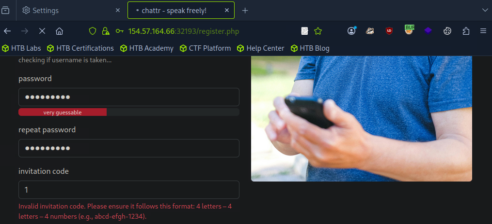

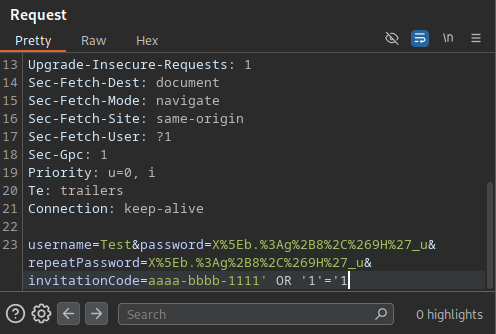

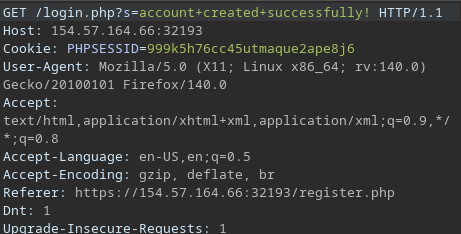

### Step 2: Identifying and Exploiting the Search Field Injection Point

Once inside the application, the messaging interface included a search field that stood out as the next candidate for injection testing. I sent a test message containing a single quote to the admin user and then searched for it. The search returned no results for the single quote while other characters worked normally, confirming that unescaped input was being passed directly into the SQL query.

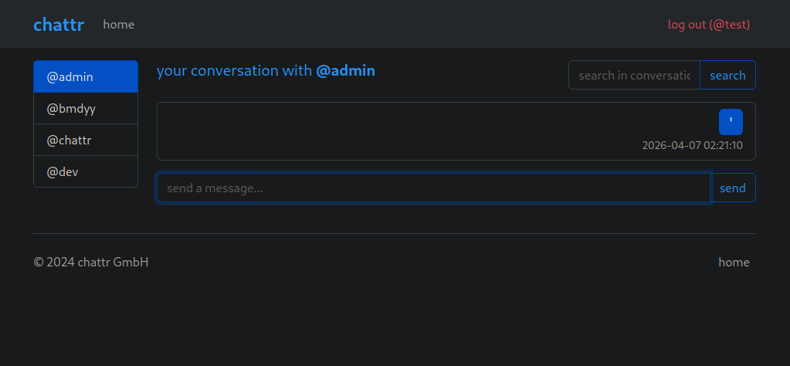

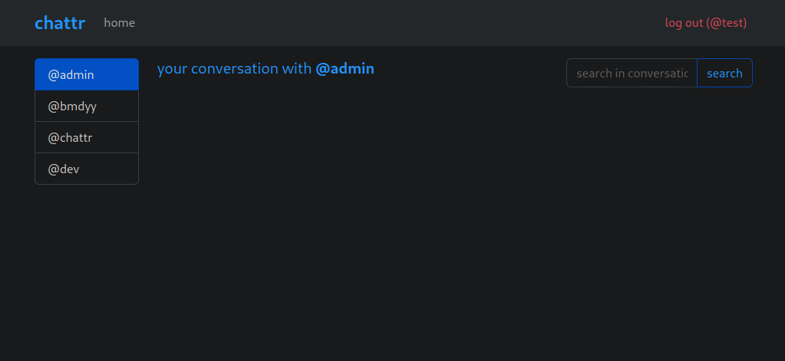

From there I worked on building a UNION-based injection. My first attempt used six columns (`') UNION ALL SELECT 1,2,3,4,5,6-- -`) which failed. Since a UNION requires both SELECT statements to have the same number of columns, the failure told me the column count was wrong rather than the syntax. I adjusted one variable at a time, reducing the column count until `') UNION SELECT 1,2,3,4-- -` returned a valid response. The output showed that column 3 was rendered in the response, giving me a visible output position for data extraction.

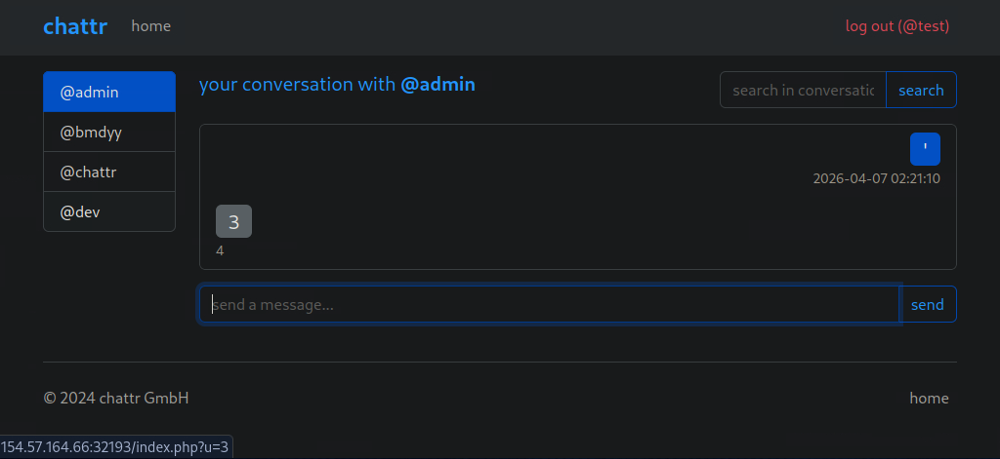

### Step 3: Enumerating the Database and Extracting the Admin Password Hash

Using the third column as the output position, I enumerated the database name (`chattr`), its tables via `INFORMATION_SCHEMA.TABLES`, and the column names of the Users table via `INFORMATION_SCHEMA.COLUMNS`. The Users table contained Username and Password columns. Querying the Password column filtered by `Username="admin"` returned the admin's Argon2i password hash. This completed the first objective but also confirmed that the injection point had full read access to the application's database, so I continued enumerating to determine what else was reachable.

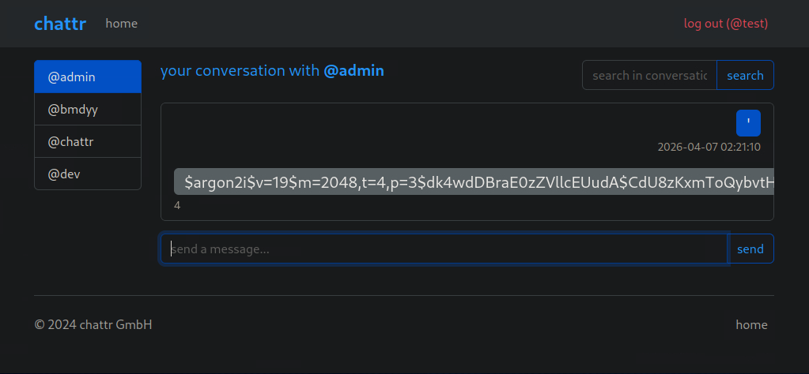

### Step 4: Confirming FILE Privileges and Reading Server Configuration

The next objective required identifying the web root path. I checked the current database user with `user()`, which returned `chattr_dbUser@localhost`. I then queried `information_schema.user_privileges` and confirmed that the FILE privilege was granted. With file read confirmed, I used `LOAD_FILE` to read `/etc/passwd`, which verified the target was a Linux host.

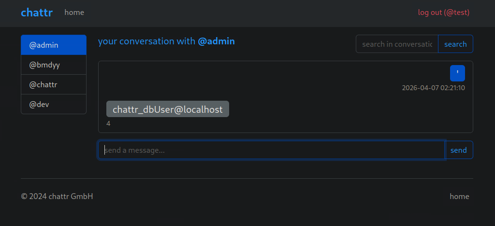

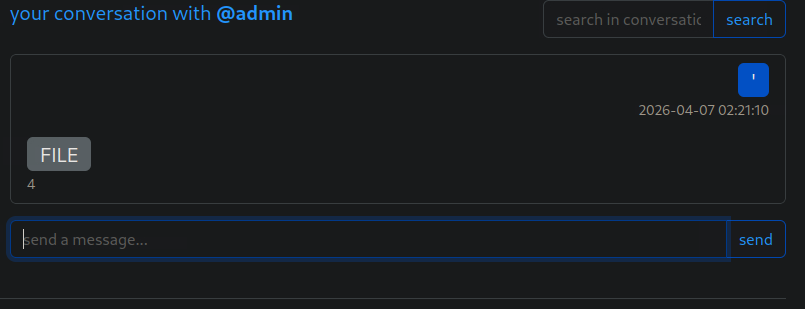

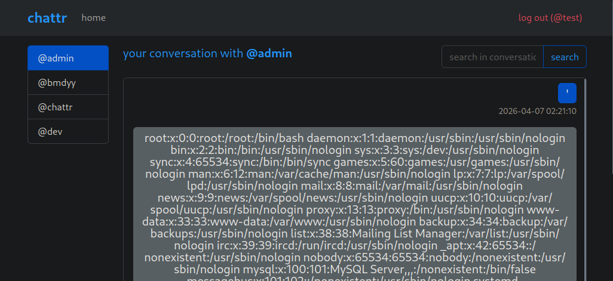

I then attempted to read the default configuration files for common web servers. Apache's default config returned nothing, but the nginx configuration at `/etc/nginx/nginx.conf` was readable and indicated that site configs were loaded from `/etc/nginx/sites-enabled/`. Rather than fuzzing the directory for filenames, I tried the standard nginx default config path first (`/etc/nginx/sites-enabled/default`) and it returned the full server block, revealing the web root as `/var/www/chattr-prod`. This was the easy win — in a real engagement where the default name had been changed, fuzzing with ffuf or a similar tool against that directory would have been the necessary next step.

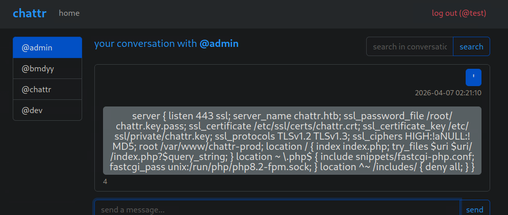

### Step 5: Verifying Write Permissions and Deploying a Web Shell

Before writing any files, I checked the `secure_file_priv` variable by querying `information_schema.global_variables`. My initial instinct was to skip this check on the logic that a failed write would imply the restriction was in place. However, a failure could also indicate a bad path or filesystem permissions, and without knowing which variable was the problem, troubleshooting would be blind. The query returned an empty value, confirming no write restrictions were enforced by the database.

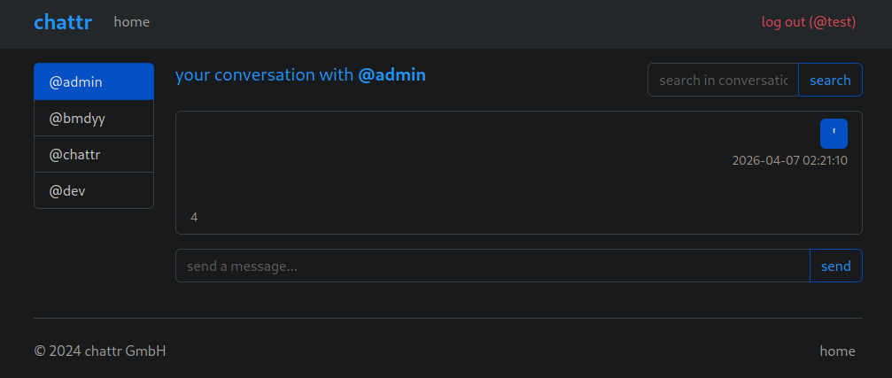

I used `SELECT INTO OUTFILE` to write a PHP web shell to `/var/www/chattr-prod/shell.php` containing a `system($_REQUEST[0])` call. Navigating to shell.php confirmed the shell was live.

### Step 6: Locating and Reading the Flag

My first attempt to list the root directory used a relative path (`shell.php?0=cd+/root`) which looked for a folder named "root" inside the web root rather than the filesystem root. Correcting to an absolute path (`?0=ls+-la+/`) listed the filesystem root and revealed the flag file. My first cat command also used a relative path (`cat flag_876a4c.txt`), which failed for the same reason. Adding the full path (`cat /flag_876a4c.txt`) returned the flag contents.

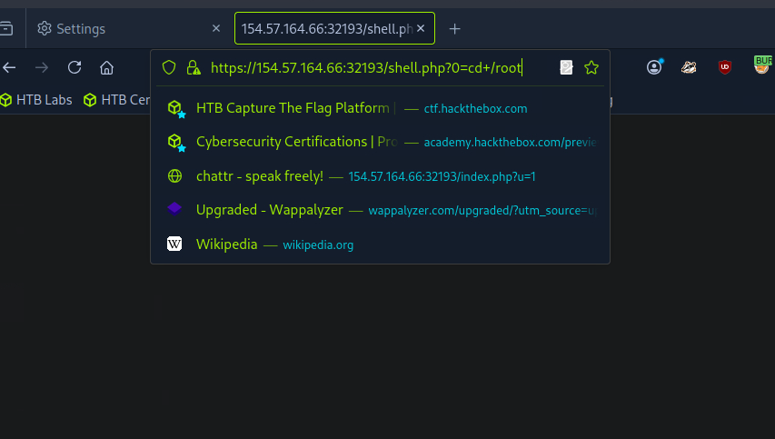

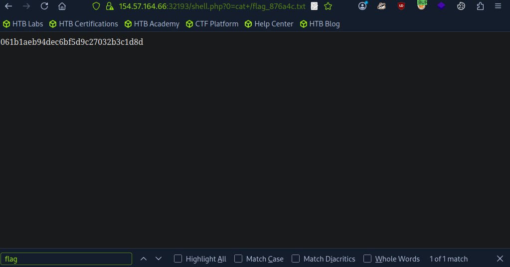

---

## Findings and Remediation

### Finding 1: SQL Injection in Invitation Code Parameter

The registration endpoint accepted unsanitized input in the invitation code field and concatenated it directly into a SQL query. A simple boolean-based bypass (`' OR '1'='1`) was sufficient to circumvent the invitation requirement entirely, granting unauthorized account creation. The client-side format validation provided no security value since it was trivially bypassed by intercepting the request in a proxy.

**Remediation:** Use parameterized queries or prepared statements for all database interactions involving user input. The invitation code should be validated server-side against a stored allowlist of valid codes rather than being inserted into a query string. Additionally, implement rate limiting on the registration endpoint to slow automated abuse.

### Finding 2: UNION-Based SQL Injection in Search Functionality

The search field passed user input directly into a SQL query without sanitization or parameterization. A UNION SELECT injection allowed full enumeration of the database schema, extraction of all user credentials including the admin password hash, and — combined with the FILE privilege — arbitrary file read and write on the underlying server. This single injection point enabled the entire attack chain from credential theft through remote code execution.

**Remediation:** Replace all dynamic SQL construction with parameterized queries. Apply input validation and output encoding as defense-in-depth measures. The database user serving the web application should follow the principle of least privilege and should not hold the FILE privilege unless there is an explicit, documented operational requirement. Revoking FILE alone would have prevented the escalation from data exfiltration to remote code execution.

### Finding 3: Excessive Database User Privileges (FILE)

The database user `chattr_dbUser` was granted the FILE privilege, enabling both `LOAD_FILE` for arbitrary file reads and `SELECT INTO OUTFILE` for arbitrary file writes. Combined with an empty `secure_file_priv` variable, this allowed reading sensitive server configuration files and writing a web shell directly into the web root. A web application database user has no legitimate need for filesystem-level access in a production environment.

**Remediation:** Revoke the FILE privilege from all application-facing database accounts. Set the `secure_file_priv` global variable to a restricted directory or NULL to prevent any file operations through SQL. Follow the principle of least privilege by granting only SELECT, INSERT, UPDATE, and DELETE on the specific databases and tables required by the application.

### Finding 4: Web Shell Write via INTO OUTFILE

The combination of FILE privilege, an unrestricted `secure_file_priv`, and a web-writable document root allowed writing a PHP web shell directly to the server. The shell provided unauthenticated remote code execution as the web server user, enabling full compromise of the host. This is the terminal impact of the SQL injection chain and represents complete loss of confidentiality, integrity, and availability of the server.

**Remediation:** In addition to revoking FILE privileges and restricting `secure_file_priv` as noted above, ensure that the web root directory is not writable by the database service account or the web server user. Enforce filesystem permissions so that only deployment processes can write to application directories. Consider deploying a web application firewall (WAF) and file integrity monitoring to detect and block unauthorized file creation in the web root.

---

## Lessons Learned

This lab reinforced that the initial injection point is not always where you expect it. I spent time testing the login form before recognizing that the registration flow was the actual weak link. That pattern — the less obvious input being the vulnerable one — is worth internalizing. In a real engagement, fixating on the most prominent form while ignoring auxiliary endpoints would cost time and potentially miss the critical finding entirely.

The UNION injection troubleshooting taught me a concrete debugging discipline: change one variable at a time. My first payload failed because of a column count mismatch, but because I was also varying the prefix text, I initially questioned whether the syntax structure was the issue. Once I isolated the column count as the only variable, the fix was immediate. When an injection fails, the instinct to change everything at once makes it harder to identify what actually matters. Column count first, then closing characters, then prefix — that sequencing would have saved time.

The escalation path from SQL injection to remote code execution was a useful exercise in chaining privileges. Each step depended on confirming a precondition before moving forward: FILE privilege granted, `secure_file_priv` empty, web root path known, directory writable. I initially considered skipping the `secure_file_priv` check on the assumption that a failed write would imply the restriction was in place, but the issue is that a failure could also indicate a bad path or filesystem permissions. Without eliminating variables upfront, troubleshooting a failed write becomes guesswork. Elimination before execution is a principle I want to carry forward.

The web shell step also exposed a basic but important habit gap: relative versus absolute paths. Both my initial directory listing and file read commands used relative paths, which resolved against the web root rather than the filesystem root. The fix was trivial once I recognized the mistake, but it cost unnecessary iterations. When operating through a web shell, every path should be absolute — there is no guarantee about the working directory, and relative paths silently resolve to the wrong location rather than throwing an error.

Overall, this lab expanded my working knowledge of UNION-based injection beyond simple data extraction into privilege enumeration, filesystem interaction, and code execution. It also gave me a concrete example of why database privilege hardening matters — revoking a single privilege (FILE) would have broken the entire escalation chain even with the injection still present.
